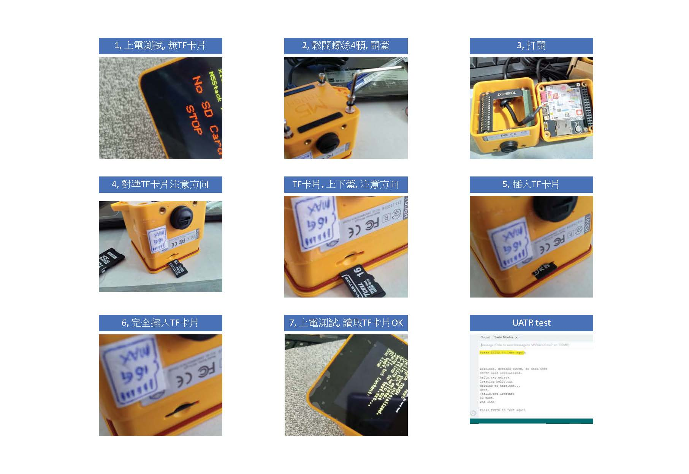

### M5Stack Tough esp32 core2 / esp32 generic compatible

testing procedure,  
  

### source code
[M5stack_Tough_TFcard_test.ino](M5stack_Tough_TFcard_test.ino)

### firmware ready and brun tools
[M5stack_Tough_TFcard_test_esp32_merged-flash.bin](M5stack_Tough_TFcard_test_esp32_merged-flash.bin)   
[burn_merged-flash.bat](burn_merged-flash.bat)   
[esptool_4.2.1.exe](esptool_4.2.1.exe)   


### notes
SD card slot, SD.h and SPI mode
```
SD.begin(GPIO4) or 
SD.begin(4) or 

```


```
//#include <M5Core2.h> // SD card ok, display NG
#include <M5Unified.h> //xiaolaba test, 2023-03-18 display ok, SD ok
```


```
//  if (!SD.begin()) { // Initialize the SD card. 初始化SD卡 TOUGH, use <M5Core2.h> ok, but display NG, uses <M5Unified.h> display ok but SD card NG
  // Tough pinout, SPI,
  //  SD card,            ChipSelect= 4, SPI_CLK=18, SPI_MI=38, SPI_MO=23
  //  LCD (ILI9342C)      ChipSelect= 5, SPI_CLK=18, SPI_MI=38, SPI_MO=23
  // referece, 
  //  https://github.com/m5stack/M5Tough, M5Tough M-BUS Schematic diagram
  //  https://docs.m5stack.com/en/core/tough, Pin Mapping, LCD Display & TF Card
  //  
  if (!SD.begin(4)) {  // Initialize the SD card. 初始化SD卡 TOUGH, GPIO4 = SD card CS pin, ok, uses <M5Unified.h>
```
